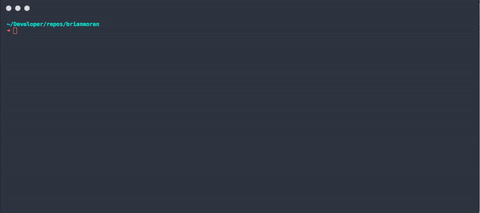

# hyperterm-dark-fusion for [hyperterm](https://hyperterm.org/)

[](https://www.npmjs.com/package/hyperterm-dark-fusion)

# hyperterm-dark-fusion
Hyperterm theme based on atom-dark-fusion https://github.com/MaxGraey/atom-dark-fusion-syntax



# Install with hpm
`hpm install hyperterm-dark-fusion`

# Install manually
Add "hyperterm-dark-fusion" to plugins in .hyper.js
```
  plugins: [
    "hyperterm-dark-fusion",
  ]
```
